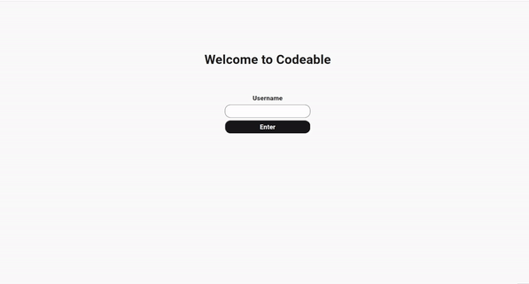
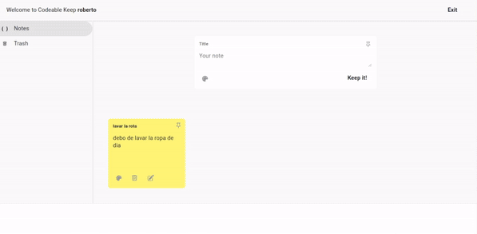
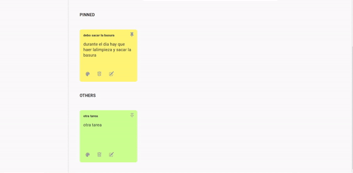

# 🌟 Aplicación de Notas con Funcionalidad Personalizada

Este proyecto, desarrollado en equipo por tres integrantes, permite al usuario registrarse e iniciar sesión para acceder a un espacio privado de notas. Tras autenticarse, el usuario puede crear, editar y eliminar notas, además de fijar aquellas más importantes en una sección especial de la página, optimizando el acceso a la información prioritaria. La aplicación utiliza LocalStorage para mantener las notas y preferencias guardadas localmente. Durante el desarrollo, adquirí una valiosa experiencia en el flujo de trabajo colaborativo, fortaleciendo habilidades de coordinación y gestión de tareas en equipo..

#DEMO:
[Demo de la Aplicación](https://projectsnotes.netlify.app/){:target="_blank"}

---

## 📋 Instalación
```bash
   git clone git@github.com:juan-arango35/notes-projects.git

   cd nombre_del_proyecto

```
npm install
npm run dev
## 🚀 Funcionalidades del Proyecto

### 1. 🔑 Login
Este sistema de autenticación permite al usuario iniciar sesión mediante un formulario simple, almacenando la información de sesión en LocalStorage. Así, el estado de usuario autenticado se conserva incluso al recargar la página, ofreciendo una experiencia de uso fluida y persistente sin necesidad de una base de datos externa.



### 2. 📝 Crear Nota
La aplicación permite al usuario crear notas personalizadas de forma rápida y sencilla, almacenándolas en LocalStorage para un acceso persistente. Cada nota se guarda localmente, lo que garantiza que la información esté disponible incluso al recargar la página.


### 3. ✏️  Editar Nota

La aplicación permite modificar notas previamente creadas, facilitando la actualización de información importante. Los cambios se guardan automáticamente en LocalStorage, asegurando que los datos editados se mantengan tras recargar la página.



### 4. 🗑️ Eliminar Nota

La aplicación permite enviar notas a una papelera de reciclaje, donde se almacenan para una posible recuperación. Las notas en la papelera pueden ser restauradas en cualquier momento o eliminadas de forma definitiva según la decisión del usuario, proporcionando un control completo sobre la gestión y organización de la información.



### 5. 🗑📌 Fijar Nota

La aplicación permite marcar notas importantes para destacarlas en una sección especial de la página. Las notas fijadas se mantienen accesibles en una ubicación prioritaria, facilitando al usuario el acceso rápido a información relevante. Esta funcionalidad garantiza que las notas más importantes siempre estén visibles y a mano.

### 6. 🗑📌 Tecnologias Utilizadas

- **Frontend Principal:**
  - 🖥️ **React** – Framework de JavaScript para construir interfaces de usuario dinámicas y reactivas.
  
- **Estilos y Componentes:**
  - 🎨 **CSS Modules** – Permite el uso de estilos locales, evitando conflictos entre clases CSS.
  - 🛠️ **clsx** – Librería para manejar clases condicionales en componentes, facilitando la organización de estilos.
  
- **Almacenamiento Local:**
  - 💾 **LocalStorage** – Permite guardar los datos de usuario (notas, autenticación) en el navegador, manteniéndolos accesibles entre sesiones.

- **Herramientas de Desarrollo:**
  - ⚡ **Vite** – Herramienta de desarrollo para crear proyectos React de forma rápida y eficiente.
  - 🔍 **ESLint** – Para asegurar la calidad del código y la consistencia en el estilo.
  
Estas tecnologías en conjunto permiten construir una aplicación ágil, con una gestión de estilos eficiente y un almacenamiento local persistente para mejorar la experiencia del usuario.


